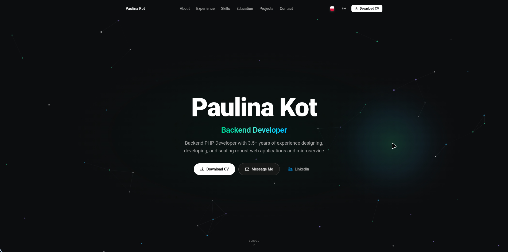

# About
A modern, dynamic portfolio and resume landing page built for high performance
and seamless content management. The frontend delivers a responsive experience
with Vue and Tailwind CSS, featuring native dark/light mode functionality.

The backend is powered by Laravel and Filament,
providing a polished administrative dashboard to
manage all experiences, projects, education etc.,
without touching the codebase.



# Installation
```bash
git clone https://github.com/paukot/resume-landing-page
cd resume-landing-page

composer install
npm install
```

Prepare environment
```bash
# Prepare env
cp .env.example .env
php artisan key:generate

# Run migrations and link storage
php artisan migrate
php artisan storage:link

#Built frontend
npm run build

# Create filament user
php artisan filament:user
```
 That's all, you can run `php artisan dev` to run app in dev mode.

# Running tests
Application has test suite for all part of the filament panel to run them simply run the command:
```bash
php artisan test
```
